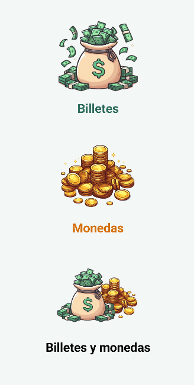
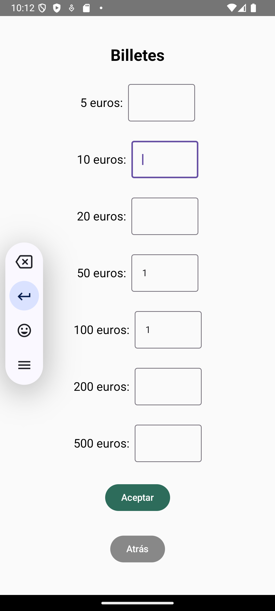
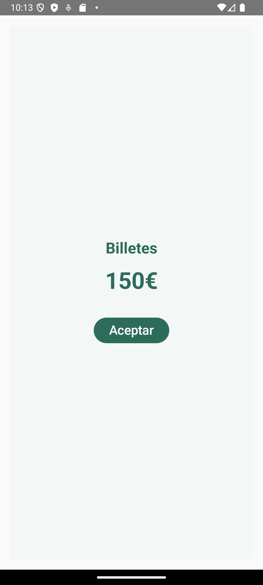
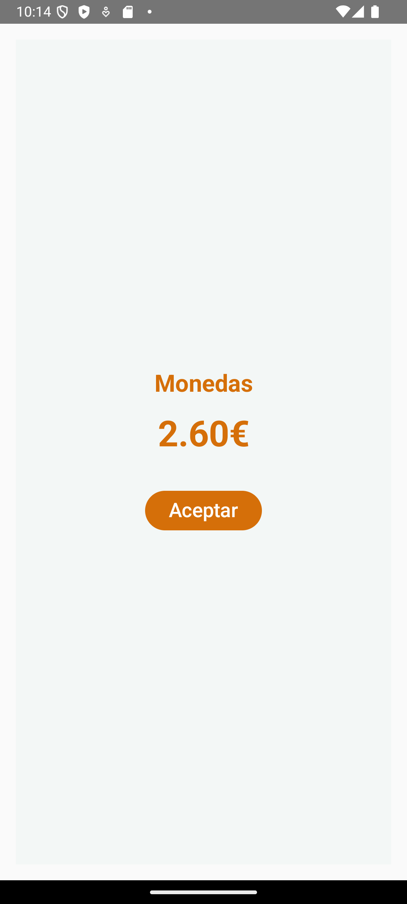
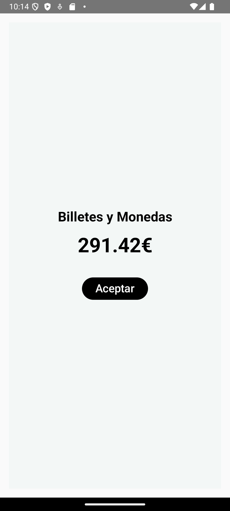

# MoneyCounter

MoneyCounter es una aplicación que permite gestionar y contar dinero fácilmente. 💸💰

  

<h3>Menú Principal</h3>

  

<h3>Billetes</h3>

  

<h3>Resultado Billetes</h3>

  

<h3>Monedas</h3>

  

<h3>Resultado Monedas</h3>

  

<h3>Resultado de Billetes y Monedas</h3>

  

<h3>Resultado Final</h3>

  
